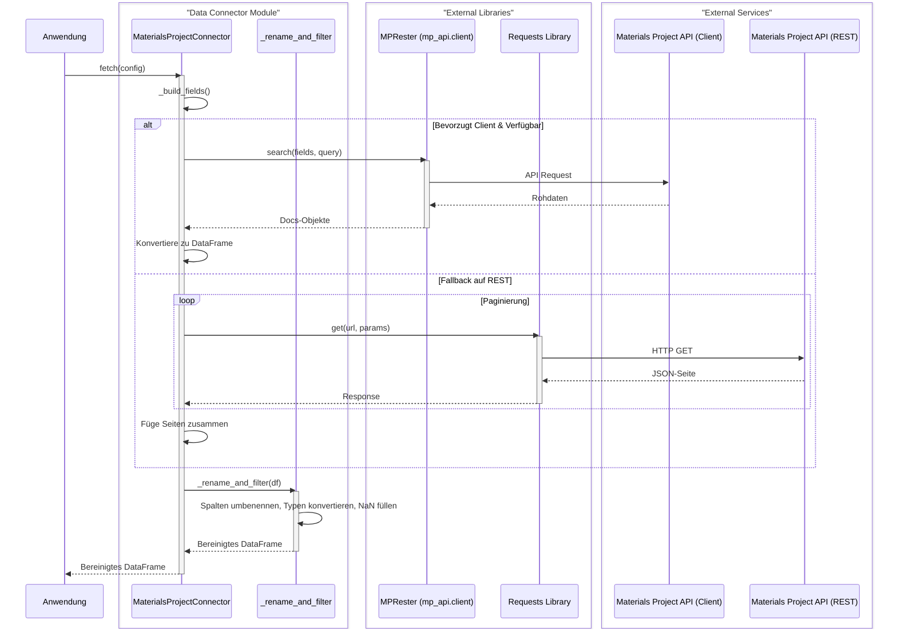

# Forge Studio: Industrial Formulation Engine

[](https://opensource.org/licenses/MIT)
[](https://www.python.org/downloads/)
[](https://streamlit.io)

**GPU-beschleunigte Rezepturoptimierung für die Materialwissenschaft und Industrie mittels eines evolutionären Algorithmus, geleitet durch ein Mycelial Prototype Graph (MPG) Surrogatmodell.**

Forge Studio ist ein Framework zur Entdeckung und Optimierung von industriellen Rezepturen und neuen Materialien. Anstatt auf langwierige Laborexperimente zu setzen, nutzt dieses Projekt einen datengesteuerten Ansatz, um den Suchraum potenzieller Materialkombinationen effizient zu durchsuchen. Der Workflow reicht von der abstrakten Definition von Zielen über die KI-gestützte Suche bis hin zur Generierung konkreter, umsetzbarer Laborrezepte.

---

## Inhaltsverzeichnis

1.  [**Problemstellung und Vision**](#1-problemstellung-und-vision)
2.  [**Architektur und Kerntechnologien**](#2-architektur-und-kerntechnologien)
    *   [Systemarchitektur im Überblick](#systemarchitektur-im-überblick)
    *   [Technologie-Stack im Detail](#technologie-stack-im-detail)
        *   [CipherCore OpenCL Treiber (DLL)](#ciphercore-opencl-treiber-dll)
        *   [Mycelial Prototype Graph (MPG) Modell](#mycelial-prototype-graph-mpg-modell)
        *   [Evolutionärer Algorithmus](#evolutionärer-algorithmus)
        *   [Robuster Datenkonnektor (`materials_mp_connector`)](#robuster-datenkonnektor-materials_mp_connector)
        *   [Rezept-Generator (`recipe_mapper`)](#rezept-generator-recipe_mapper)
3.  [**Installation und Einrichtung**](#3-installation-und-einrichtung)
    *   [Voraussetzungen](#voraussetzungen)
    *   [Installationsanleitung](#installationsanleitung)
4.  [**Benutzerhandbuch**](#4-benutzerhandbuch)
    *   [Starten der Anwendung](#starten-der-anwendung)
    *   [Workflow: Von der Idee zum Rezept](#workflow-von-der-idee-zum-rezept)
        *   [Tab B: Evolutionäre Formulierung entwerfen](#tab-b-evolutionäre-formulierung-entwerfen)
        *   [Tab C: Diagnostik der Suche](#tab-c-diagnostik-der-suche)
        *   [Tab D: Rezept-Generator](#tab-d-rezept-generator)
5.  [**Fallstudie & Testergebnisse**](#5-fallstudie--testergebnisse)
    *   [Die Herausforderung: Konvergenz zu suboptimalen Ergebnissen](#die-herausforderung-konvergenz-zu-suboptimalen-ergebnissen)
    *   [Der Durchbruch: "Constrained Optimization"](#der-durchbruch-constrained-optimization)
    *   [Beispielhafte Ergebnisse](#beispielhafte-ergebnisse)
6.  [**Anhang**](#6-anhang)
    *   [Dokumentation der Projektdateien](#dokumentation-der-projektdateien)
    *   [Glossar](#glossar)
    *   [Zukünftige Arbeit und Ausblick](#zukünftige-arbeit-und-ausblick)
    *   [Lizenz](#lizenz)

---

## 1. Problemstellung und Vision

Die Entdeckung neuer Materialien ist traditionell ein langsamer, von Versuch und Irrtum geprägter Prozess. Forge Studio adressiert dieses Problem, indem es einen intelligenten und automatisierten Workflow bietet.

> **Problem:** Die manuelle Suche nach neuen Materialien mit spezifischen Eigenschaften (z.B. hohe Stabilität und eine bestimmte Bandlücke für Halbleiter) ist extrem zeit- und kostenintensiv.
>
> **Lösung:** Forge Studio ersetzt diesen Prozess durch eine **KI-gestützte, evolutionäre Suche**. Ein Surrogatmodell, das auf Tausenden bekannten Materialien trainiert wurde, bewertet in Sekundenbruchteilen die Eigenschaften hypothetischer neuer Materialien. Ein evolutionärer Algorithmus nutzt dieses Modell, um den "genetischen Code" (die Rezeptur) über Hunderte von Generationen zu optimieren, bis die besten Kandidaten gefunden sind.

Das System schließt den Kreis von der abstrakten Anforderung ("Ich brauche ein stabiles Material mit großer Bandlücke") bis zum konkreten, handlungsorientierten Ergebnis ("Mische 14.17g MgO mit 35.84g Al₂O₃, um 50g MgAl₂O₄ herzustellen").

## 2. Architektur und Kerntechnologien

### Systemarchitektur im Überblick

Forge Studio basiert auf einer robusten dreischichtigen Architektur, die eine klare Trennung von Verantwortlichkeiten gewährleistet:

```
[ UI (Streamlit, forge_studio_ui.py) ] <--> [ Backend (Python, forge_backend.py) ] <--> [ Treiber (C/OpenCL, CipherCore_OpenCl.dll) ] <--> [ GPU ]
```

*   **UI-Schicht:** Eine interaktive Web-Anwendung, die mit Streamlit erstellt wurde. Sie dient als benutzerfreundliche Schnittstelle zur Steuerung des komplexen Backend-Prozesses.
*   **Logik-Schicht:** Das Herzstück in Python. Es implementiert den evolutionären Algorithmus, steuert das Training des Surrogatmodells und managt den gesamten Optimierungsworkflow.
*   **Compute-Schicht:** Eine in C geschriebene Hochleistungsbibliothek, die über OpenCL direkt auf die parallelen Rechenkerne der GPU zugreift, um rechenintensive Aufgaben massiv zu beschleunigen.

### Technologie-Stack im Detail

#### CipherCore OpenCL Treiber (DLL)

Die `CipherCore_OpenCl.dll` ist eine externe C-Bibliothek, die als Brücke zwischen Python und der GPU fungiert.

*   **Zweck:** Auslagerung von rechenintensiven Operationen, die auf einer CPU ineffizient wären.
*   **Funktionen:** Bietet eine C-API für Aufgaben wie:
    *   **GPU-Initialisierung** und Kontextmanagement.
    *   **Speicherverwaltung** (Allokation, Freigabe, Host-Device-Transfers).
    *   **Kompilierung & Ausführung von OpenCL-Kernels** für:
        *   Batched-Matrix-Multiplikation
        *   Paarweise Ähnlichkeitsberechnungen
        *   GPU-beschleunigtes K-Means-Clustering
        *   Simulation des Myzel-Pheromon-Systems

#### Mycelial Prototype Graph (MPG) Modell

Das MPG-Modell ist ein **Surrogatmodell**, das als schneller Ersatz für teure Simulationen dient.

*   **Prototype Graph:** Das Modell lernt während des Trainings eine Reihe von **Prototypen** – dies sind repräsentative Datenpunkte (Clusterzentren) im hochdimensionalen Raum der Materialeigenschaften. Wenn eine neue, unbekannte Rezeptur bewertet werden muss, werden ihre Eigenschaften durch einen Vergleich mit diesen gelernten Prototypen schnell interpoliert.
*   **Mycelial Guidance:** Der "myzeliale" Aspekt bezieht sich auf ein **Pheromon-System**, das den evolutionären Algorithmus leitet. Wie ein Pilzmyzel, das Nährstoffe im Boden findet, hinterlässt der Algorithmus "Pheromonspuren" in den vielversprechenden Bereichen des Suchraums. Dies steuert die Balance zwischen **Exploitation** (Ausnutzung bekannter guter Regionen) und **Exploration** (Suche in neuen, unbekannten Regionen).

#### Evolutionärer Algorithmus

Der Kern des Optimierers ist ein genetischer Algorithmus, der den Prozess der natürlichen Selektion nachahmt:

1.  **Initialisierung:** Eine große, zufällige "Population" von Kandidaten-Rezepturen wird erstellt.
2.  **Bewertung (Fitness):** Das MPG-Modell sagt die Eigenschaften jedes Kandidaten voraus. Eine anpassbare Bewertungsfunktion (`score_formulations`) berechnet einen "Fitness-Score" basierend auf den vom Benutzer definierten Zielen (z.B. maximiere Bandlücke, minimiere Bildungsenergie).
3.  **Selektion:** Die besten Kandidaten ("Eliten") überleben und werden für die nächste Generation ausgewählt.
4.  **Reproduktion:** Neue Kandidaten ("Kinder") werden durch `crossover_blend` (Kombination zweier Eltern) und `mutate_gaussian` (zufällige kleine Änderungen) erzeugt.
5.  **Wiederholung:** Dieser Prozess wird über Hunderte von Generationen wiederholt, wobei sich die Population schrittweise in Richtung immer besserer Lösungen entwickelt.

#### Robuster Datenkonnektor (`materials_mp_connector`)

Dieses Modul ist eine flexible und widerstandsfähige Schnittstelle zur Materials Project API.

*   **Dual-Mode-Zugriff:** Nutzt bevorzugt den offiziellen `mp-api` Python-Client, verfügt aber über einen automatischen **Fallback-Mechanismus** auf eine generische REST-API-Implementierung mit `requests`. Dies erhöht die Ausfallsicherheit.
*   **Intelligente Datenbereinigung:** Führt eine Reihe kritischer Vorverarbeitungsschritte durch:
    *   **Spalten-Mapping:** Eine `ColumnMap`-Struktur bildet die API-Feldnamen flexibel auf die internen Anwendungsnamen ab.
    *   **Typkonvertierung & Fehlerbehandlung:** Konvertiert alle Spalten robust in numerische Typen.
    *   **Datenverlust-Minimierung:** Entfernt Zeilen nur, wenn *alle* Zielgrößen fehlen.
    *   **Imputation:** Füllt fehlende Werte in *Feature*-Spalten automatisch mit dem Spaltenmittelwert auf, um die Daten für das ML-Training vorzubereiten.

##### Datenfluss des Konnektors



#### Rezept-Generator (`recipe_mapper`)

Dieses Modul schließt die Lücke zwischen den abstrakten, optimierten Eigenschaftsvektoren und der realen Welt.

1.  **Kandidaten-Mapping:** Für jede vom evolutionären Algorithmus gefundene Top-Lösung durchsucht es die Materials Project Datenbank nach **realen Materialien**, die diesen Eigenschaften am nächsten kommen.
2.  **Konsens-Ranking:** Es analysiert die Ergebnisse über alle Top-Lösungen hinweg und erstellt ein Ranking der Materialien, die am häufigsten als gute Übereinstimmung identifiziert wurden.
3.  **Rezept-Generierung:** Für die besten Konsens-Kandidaten generiert es **konkrete Laborrezepte**, inklusive der stöchiometrisch korrekten Massen der benötigten oxidischen Ausgangsstoffe.

## 3. Installation und Einrichtung

### Voraussetzungen

*   Python ≥ 3.10
*   Eine OpenCL 1.2+ fähige GPU (NVIDIA, AMD, Intel) mit aktuellen Treibern
*   Ein C/C++ Compiler (GCC, Clang oder MSVC)
*   Git

### Installationsanleitung

1.  **Repository klonen:**
    ```bash
    git clone <repository-url>
    cd ForgeStudio
    ```

2.  **Python-Abhängigkeiten installieren:**
    ```bash
    pip install streamlit pandas numpy scikit-learn mp-api requests
    ```

3.  **CipherCore DLL kompilieren:**
    Navigieren Sie in das Verzeichnis mit der C-Quelldatei `opencl_driver.c`.

    *   **Unter Linux/macOS (mit GCC/Clang):**
        ```bash
        # Der -I Pfad muss möglicherweise an Ihr System angepasst werden
        gcc -shared -o CipherCore_OpenCl.so -fPIC opencl_driver.c -lOpenCL
        ```

    *   **Unter Windows (mit MSVC in einer "Developer Command Prompt"):**
        ```bash
        # 'path\to\opencl\sdk' an den Installationsort Ihres OpenCL SDKs anpassen
        cl /LD opencl_driver.c -I"path\to\opencl\sdk\include" "path\to\opencl\sdk\lib\OpenCL.lib" /FeCipherCore_OpenCl.dll
        ```
    > **Wichtig:** Stellen Sie sicher, dass die kompilierte Bibliothek (`CipherCore_OpenCl.dll` oder `.so`) im Projektverzeichnis liegt, damit sie von der automatischen Erkennung gefunden wird.

## 4. Benutzerhandbuch

### Starten der Anwendung

1.  Öffnen Sie ein Terminal im Projektverzeichnis.
2.  Führen Sie den Befehl aus: `streamlit run forge_studio_ui.py`
3.  Die Anwendung öffnet sich in Ihrem Browser unter `http://localhost:8501`.

### Workflow: Von der Idee zum Rezept

#### Tab B: Evolutionäre Formulierung entwerfen
Dies ist Ihr Startpunkt und Hauptkontrollzentrum.

1.  **Problem & Ziele:** Wählen Sie ein Problem wie "Stabile Halbleiter". Definieren Sie Ihre Ziele, z.B. `Bandlücke` (Gewicht `1.0`), `Bildungsenergie` (Gewicht `-0.5`).
2.  **Datenquelle:** Geben Sie Ihren **Materials Project API-Key** ein. Verwenden Sie eine breite **MP Query** wie `*-O` (alle Oxide), um dem Modell eine große, vielfältige Trainingsbasis zu geben.
3.  **Simulations-Parameter:**
    *   **Population:** `512` oder mehr für eine breite Suche.
    *   **Generationen:** `100` oder mehr für eine tiefe Optimierung.
    *   **Anzahl Prototypen:** `256` oder mehr, um die Komplexität und "Auflösung" des Modells zu erhöhen.
4.  **Myzel-Parameter:** Starten Sie mit einer niedrigen **Guidance-Stärke** (z.B. `0.2`), um die Erkundung des Lösungsraums zu fördern.
5.  **Synthese starten:** Klicken Sie auf den Button, um den GPU-beschleunigten Lauf zu starten.

#### Tab C: Diagnostik der Suche
Nach Abschluss eines Laufs können Sie hier die Leistung analysieren.
*   **Fitness-Verlauf:** Die wichtigste Grafik! Ein stetiger Anstieg des "best_norm"-Scores zeigt, dass der Algorithmus erfolgreich lernt und sich verbessert.
*   **Myzel-Aktivität:** Gibt Einblick in die Dynamik der Pheromon-Lenkung.

#### Tab D: Rezept-Generator
Dieser Tab erscheint, nachdem Ergebnisse vorliegen.
1.  **Konfigurieren:** Wählen Sie, wie viele reale Kandidaten pro Ziel gesucht und wie viele Rezepte generiert werden sollen.
2.  **Mapping starten:** Klicken Sie auf den Button. Das System gleicht Ihre optimierten Ergebnisse mit der Materials Project Datenbank ab.
3.  **Ergebnisse analysieren:**
    *   **Vorgeschlagene Materialien:** Zeigt eine Liste realer Materialien (z.B. `ZrO2`, `Al2O3`) für jede Ihrer Top-Lösungen.
    *   **Konsens-Ranking:** Eine aggregierte Rangliste der robustesten Kandidaten.
    *   **Generierte Labor-Rezepte:** Detaillierte, umsetzbare Anleitungen zur Synthese der Top-Kandidaten, inklusive stöchiometrisch berechneter Massen der Ausgangsstoffe.

## 5. Fallstudie & Testergebnisse

Die Entwicklung von Forge Studio war ein iterativer Prozess zur Überwindung typischer Herausforderungen im Machine Learning.

### Die Herausforderung: Konvergenz zu suboptimalen Ergebnissen
Erste erfolgreiche Läufe zeigten ein "kollabiertes" Modell: Der Score sprang sofort auf den Maximalwert, und die Vorhersagen waren für alle Kandidaten identisch. Das Modell war nicht komplex genug, die Bewertungsfunktion zu einfach, und der Algorithmus stagnierte.

### Der Durchbruch: "Constrained Optimization"
Die finale, erfolgreiche Strategie war eine Vereinfachung der Aufgabe für die KI, die zu deutlich besseren und aussagekräftigeren Ergebnissen führte:
1.  **Daten filtern:** Das Modell wird ausschließlich auf **nachweislich stabilen Materialien** trainiert (`energy_above_hull ≤ 0.02 eV/Atom`).
2.  **Ziel fokussieren:** Das Modell wird darauf trainiert, **nur eine primäre Eigenschaft** (z.B. `band_gap`) vorherzusagen.
3.  **Score neu definieren:** Die Bewertungsfunktion kombiniert die **Modellvorhersage** (z.B. `pred_band_gap`) mit den **direkten "Genen"** des Kandidaten (z.B. `formation_energy_per_atom`), um einen echten Kompromiss zu bewerten.

### Beispielhafte Ergebnisse
Mit dieser Methode zeigt die Anwendung das gewünschte Verhalten. Der Fitness-Verlauf im Diagnostik-Tab demonstriert einen klaren Lernprozess. Der Rezept-Generator liefert am Ende eine Liste konkreter, vielversprechender Materialien wie `Al2O3`, `ZrO2`, `HfO2` und `MgAl2O4` – alle mit realistischen, stöchiometrisch korrekten Laborrezepten.

## 6. Anhang

### Dokumentation der Projektdateien
*   `forge_studio_ui.py`: Implementiert die Streamlit-UI, steuert den Workflow zwischen den Tabs.
*   `forge_backend.py`: Enthält die Kernlogik: die `CipherCore`-Klasse (GPU-Wrapper), die `MPGModel`-Definition, die evolutionären Operatoren (`crossover`, `mutation`) und die Hauptoptimierungsschleife `mycelial_guided_evolution`.
*   `materials_mp_connector.py`: Kapselt den gesamten Datenabruf und die Vorverarbeitung von der Materials Project API.
*   `recipe_mapper.py`: Enthält die Logik, um abstrakte Eigenschaftsvektoren in reale Materialien zu mappen und Laborrezepte zu generieren.
*   `CipherCore_OpenCl.dll` / `opencl_driver.c`: Die kompilierte GPU-Compute-Bibliothek und ihr C-Quellcode.

### Glossar
*   **API (Application Programming Interface):** Eine Softwareschnittstelle zur Interaktion.
*   **Bandlücke (Band Gap):** Ein Maß für die Energie, die benötigt wird, um ein Elektron in einem Material leitfähig zu machen. Entscheidend für Halbleiter.
*   **Energie über der Hull (Energy Above Hull):** Ein Maß für die thermodynamische Stabilität eines Materials (Ziel: ≤ 0).
*   **Evolutionärer Algorithmus:** Eine von der biologischen Evolution inspirierte Optimierungsmethode.
*   **Feature:** Eine Eingabevariable für ein Machine-Learning-Modell (z.B. Dichte).
*   **Imputation:** Das Ersetzen fehlender Datenwerte durch statistisch geschätzte Werte.
*   **Kernel (OpenCL):** Ein kleines Programm, das zur Ausführung auf den parallelen Einheiten einer GPU geschrieben wurde.
*   **MPG (Mycelial Prototype Graph):** Der Name des in diesem Projekt verwendeten Surrogatmodells.
*   **OpenCL:** Ein offener Standard für die parallele Programmierung auf heterogenen Systemen (wie GPUs).
*   **Surrogatmodell:** Ein schnelles Machine-Learning-Modell, das als "Ersatz" für eine langsame Simulation oder ein teures Experiment dient.
*   **Paginierung:** Das Aufteilen großer Datenmengen in kleinere "Seiten" für den Abruf über eine API.

### Zukünftige Arbeit und Ausblick
*   **Erweiterte Imputationsstrategien:** Implementierung von Median- oder k-NN-Imputation.
*   **Caching-Mechanismen:** Lokales Caching von API-Abfragen zur Beschleunigung wiederholter Läufe.
*   **Asynchrone Abrufe:** Steigerung der Parallelität bei der Datenbeschaffung.
*   **Erweiterung auf andere Datenbanken:** Integration weiterer Materialdatenbanken (z.B. OQMD, AFLOW).

### Lizenz
Dieses Projekt ist unter der **MIT-Lizenz** lizenziert.
